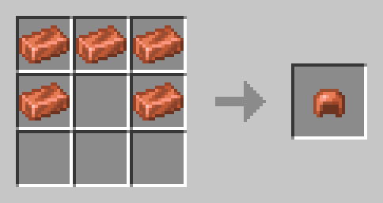
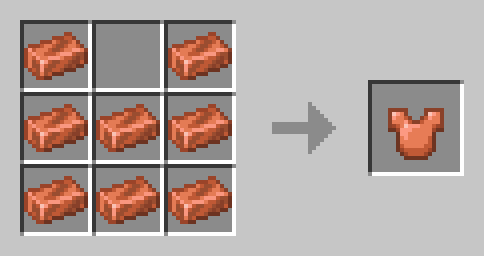

## Gameplay
### Gameplay Mechanics

## Items
### Bounty Scroll:
This scroll can be found when using a bounty board which can only be found at a Trader Outpost. Once you've obtained the scroll you'll be prompted with a UI where you can do your Bounties.

###  Copper Axe:
The Copper Axe is used just like any other axe. However it can break wooden blocks faster than stone so it's great for early game players.

The following stats are for the Copper Axe:
- 365 Durability
- 4 Attack Damage
- 3 Break Speed

## Blocks

## Mobs

## Structures

## Bosses

## Boss Structures

## Biomes

## Systems

## Crafting
### Copper Category
Copper Helmet:
 

Copper Chestplate:
 