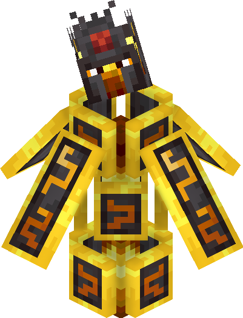

::: warning
This wiki is still being updated as the Add-On gets worked on.
:::

## Gameplay
### Gameplay Mechanics

## Items
### Bounty Scroll:
This scroll can be found when using a bounty board which can only be found at a Trader Outpost. Once you've obtained the scroll you'll be prompted with a UI where you can do your Bounties.

### Copper Axe:
The Copper Axe is used just like any other axe. However it can break wooden blocks faster than stone so it's great for early game players.

The following stats are for the Copper Axe:

- 365 Durability
- 4 Attack Damage
- 3 Break Speed

## Blocks

## Mobs
### Nether:
#### Inferno:

> Part of the Misfits Add-On.

The Inferno is a boss that can only be found in the nether via a super rare structure. Killing it will drop a Blaze Eye.

::: tip
Info about the Inferno
::: 

- 500 HP
- 4-8 Attack Damage
- 3 Attacks
- 2 Phases

## Structures

## Bosses

## Boss Structures

## Biomes

## Systems

## Crafting
### Copper Category
Copper Helmet:
 

Copper Chestplate:
 