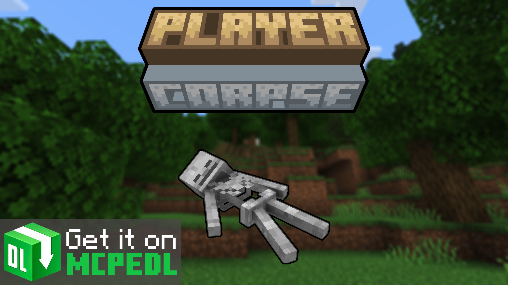

<post align="center" title="Check my other work!" link="https://mcpedl.com/player-corpse/">

   

</post>

<template>
    

        <link rel="stylesheet" href="https://cdnjs.cloudflare.com/ajax/libs/font-awesome/4.7.0/css/font-awesome.min.css">

<!-- Auto width -->
<button class="btn"><i class="fa fa-download"></i> Download</button>

<!-- Full width -->
<button class="btn" style="width:100%"><i class="fa fa-download"></i> Download</button>
    

</template>

