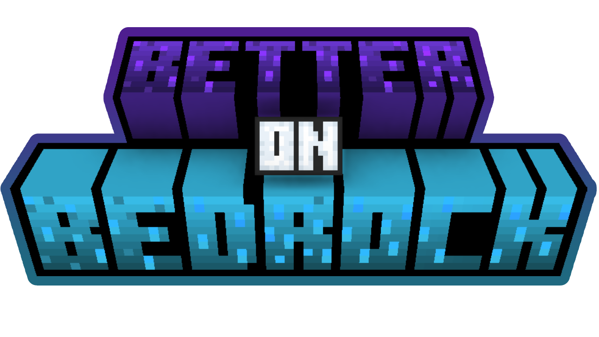

   

<post title="Bedrock Wiki!" link="https://discord.gg/tcrXYbXjZb">
Join the Bedrock Wiki to learn and make your first Add-On!
</post>

## What is it?

# Main Features

Better on Bedrock is a Minecraft Bedrock Edition Add-On that aims to improve Bedrock Edition. It adds many new features like overhauling biomes, new usefull items and adding new mobs.

<h2></h2>

Better on Bedrock is designed to feel Vanilla. This means that all mobs, textures and behaviors will feel in place and feel Minecrafty.

 

<h2></h2>

Better on Bedrock aims to add items that won't be useless. Minecraft already has too many items that are useless but Better on Bedrock changes that!

 

## Features
# Main Features

When playing Better on Bedrock you will encounter unique systems. One of which is the Bounty System. This system will allow you to do side mission to earn extra rewards to keep you intrested in gameplay.

 

<h2></h2>

You might find a rare monument in the Overworld that contains a Waystone. Waystones can be used to teleport to any point but they consume levels.

 

## How to play?
Read more [here](/better-on-bedrock-wiki) on how to play the Add-On.

